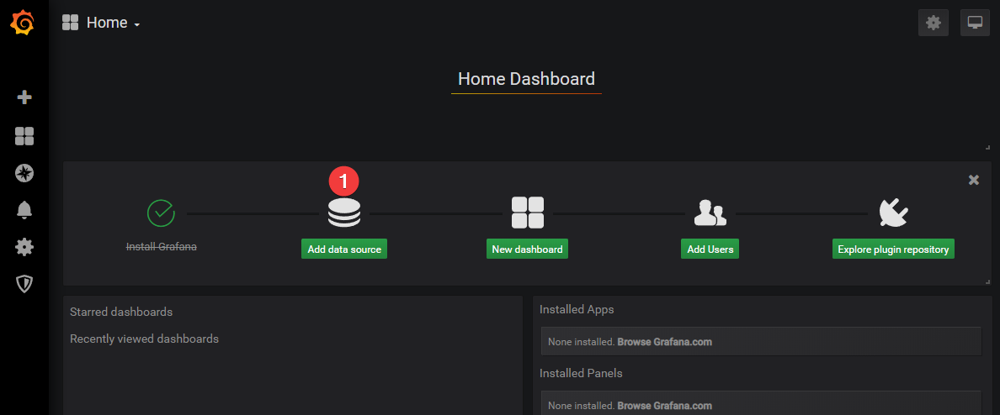
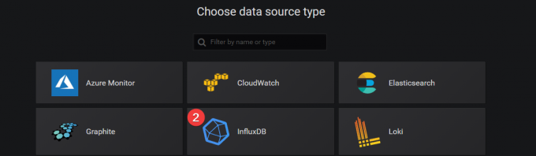
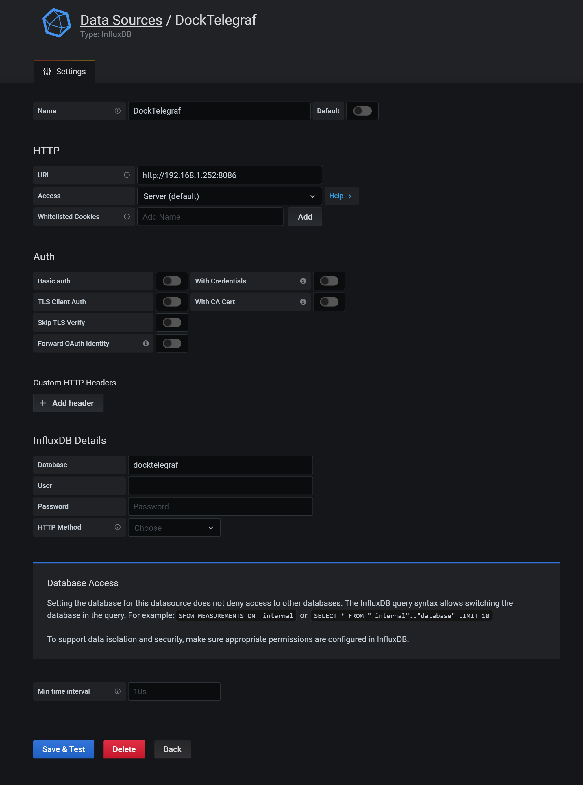
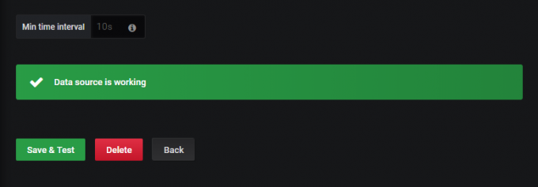
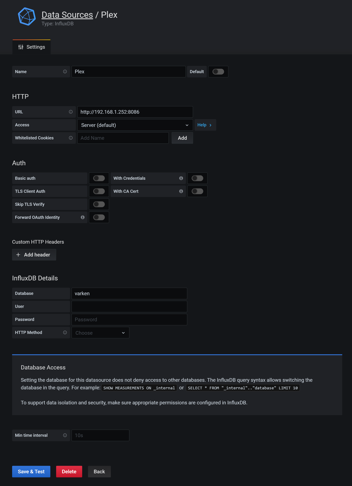
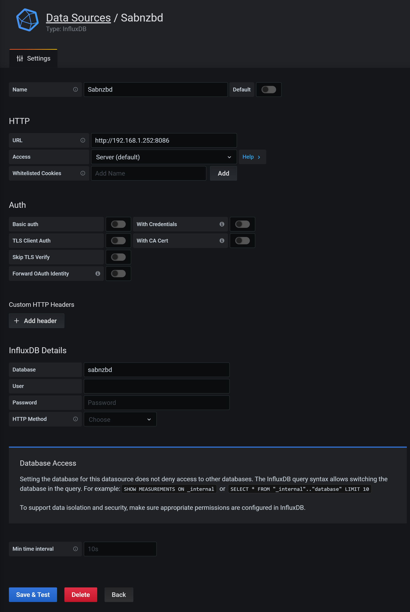
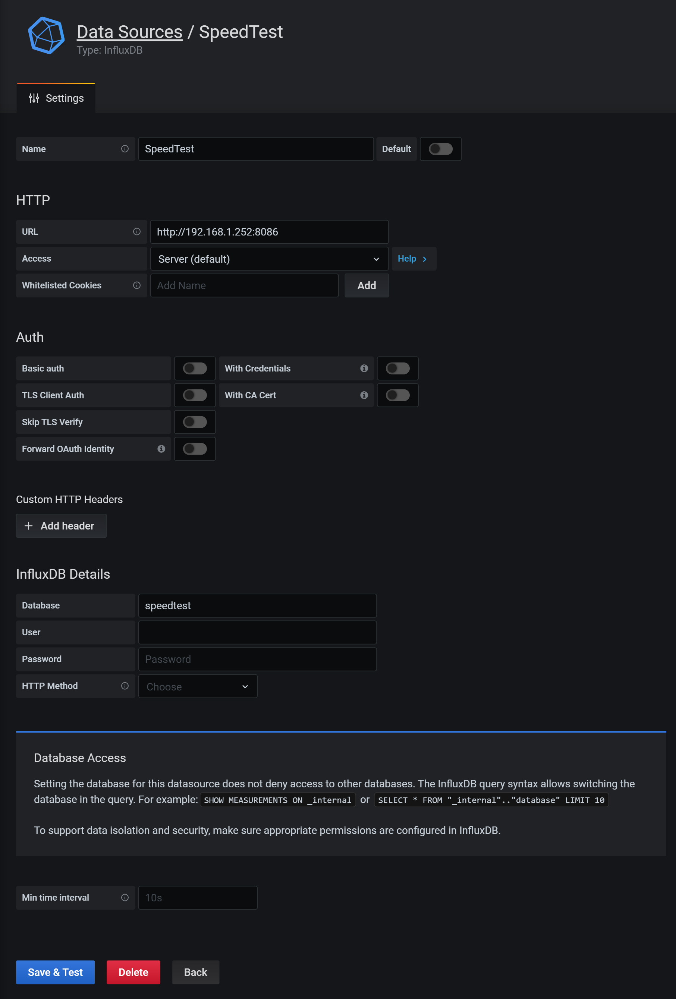

# Grafana.Dashboard
Grafana dashboard for monitoring virtual machines, pihole, nas, docker containers and plex ecosystem!!


### Table of Contents
- [How it Works](#How-it-Works)
- [Installing InfluxDB](#Installing-InfluxDB)
- [Installing Telegraf](#Installing-Telegraf)
  * [Installing HDDTemp](#Installing-HDDTemp)
  * [Installing Sensors for Temp Monitoring](#Installing-Sensors-for-Temp-Monitoring)
- [Installing Varken](#Installing-Varken)
- [Installing Sabnzbd Script](#Installing-Sabnzbd-Script)
- [Installing Speedtest](#Installing-Speedtest)
- [Setting up Pihole](#Setting-up-Pihole)
  * [Pihole running on Debian](#Pihole-running-on-Debian)
  * [Pihole running on Docker](#Pihole-running-on-Docker)
- [Installing Grafana](#Installing-Grafana)
  * [Setting up data source](#Setting-up-data-source)
    * [Telegraf](#Telegraf)
    * [Varken - Plex Ecosystem](#Varken-Plex-Ecosystem)
    * [Sabnzbd](#Sabnzbd)
    * [SpeedTest](#SpeedTest)
  * [Configuring Grafana](#Configuring-Grafana)
---

<p align="center"></p>

---

## How it Works
In getting all this setup, there are 3 main moving parts. Telegraf, InfluxDB and Grafana.
Telegraf is what collects all the different system metrics and outputs it to an InfluxDB database that Grafana uses to visualize everything with pretty graphs and bars.

<p align="center">
  
</p>

---

## Installing InfluxDB

1. Download the config file and place it in the influxdb appdata folder i.e. ./docker/influxdb
2. Run the docker-compose.

```ini
# INFLUXDB - DATABASE FOR SENSOR DATA
  influxdb:
    image: influxdb:latest
    container_name: influxdb
    restart: always
    security_opt:
      - no-new-privileges:true
    ports:
      - 8086:8086
      - 8089:8089/udp
    volumes:
      - ./docker/influxdb/influxdb.conf:/etc/influxdb/influxdb.conf:ro
      - ./docker/influxdb/db:/var/lib/influxdb
    environment:
      - TZ=Europe/Amsterdam
      - INFLUXDB_HTTP_ENABLED=true
      - INFLUXDB_DB=host
    command: -config /etc/influxdb/influxdb.conf
```
---

## Installing Telegraf
##### Telegraf needs to be installed on each server / device separately unlike Influxdb.

1. Download the config file and place it in the telegraf appdata folder i.e. ./docker/telegraf
2. Edit the telegraf.conf file. Scroll down to **OUTPUT PLUGINS** and edit the **url** on line 106 and **database** on the 110.
```ini
# Configuration for sending metrics to InfluxDB
[[outputs.influxdb]]
  urls = ["http://192.168.1.252:8086"]

  ## The target database for metrics; will be created as needed.
  ## For UDP url endpoint database needs to be configured on server side.
 database = "docktelegraf"
```
###### 192.168.1.252 is the IP address of the server running InfluxDB and 8086 is the default InfluxDB port. InfluxDB will save the metrics sent from telegraf under docktelegraf database.

3. Scroll further down to **INPUT PLUGINS** and edit the **url** on line 247.
```ini
# # PiHole monitoring
[[inputs.http]]
    urls = ["http://192.168.1.253/admin/api.php"]
```
###### 192.168.1.253 is the IP address of the pihole server.

4. Incase you are using default config file, the following input plugins needs to be enabled so that all the panels on the Grafana dashboard will work. It is curently enabled in the attached config file.
```
[[inputs.docker]]

[[inputs.hddtemp]]

[[inputs.net]]

[[inputs.netstat]]

[[inputs.sensors]]

[[inputs.http]]

[[inputs.exec]]

[[inputs.file]]
```
---

#### Installing HDDTemp

For the hddtemp input to work, we need to install the HDDTemp container. There is nothing special to configure here except the time zone variable.

```ini
# HDDTEMP - MONITOR HDD TEMPS
  hddtemp:
    image: drewster727/hddtemp-docker:latest
    container_name: hddtemp
    restart: unless-stopped
    privileged: true
    environment:
      - HDDTEMP_ARGS="-q -d -F /dev/sd*"
      - TZ=Europe/Amsterdam
```

#### Installing Sensors for Temp Monitoring
```ini
# Install lm-sensor
sudo apt install lm-sensors

# Detect all the sensors
sudo sensors-detect --auto
```

5. Run the docker-compose.

```ini
# TELEGRAF - SERVER TELEMERTY AND METRICS COLLECTOR
  telegraf:
    image: telegraf:latest
    container_name: telegraf
    restart: unless-stopped
    security_opt:
      - no-new-privileges:true
    volumes:
      - ./docker/telegraf/telegraf.conf:/etc/telegraf/telegraf.conf:ro
      - /var/run/docker.sock:/var/run/docker.sock:ro
      - /sys:/rootfs/sys:ro
      - /proc:/rootfs/proc:ro
      - /etc:/rootfs/etc:ro
    environment:
      - TZ=Europe/Amsterdam
      - HOST_PROC=/rootfs/proc
      - HOST_SYS=/rootfs/sys
      - HOST_ETC=/rootfs/etc
```
---

## Installing Varken

1. Download the config file and place it in the varken appdata folder i.e. ./docker/varken
2. Edit the config file. Detailed instructions can be found [here](https://wiki.cajun.pro/books/varken/page/breakdown).
3. Run the docker-compose.

```ini
# VARKEN - MONITOR PLEX, SONARR, RADARR, AND OTHER DATA
  varken:
    image: boerderij/varken:latest
    container_name: varken
    restart: unless-stopped
    security_opt:
      - no-new-privileges:true
    volumes:
      - ./docker/varken:/config
    environment:
      - PUID=1000
      - PGID=1000
      - TZ=Europe/Amsterdam
```
---

## Installing Sabnzbd Script

1. Edit the environmental values in the docker-compose.
2. Run the docker-compose.

```ini
# SABNZBD SCRIPT – SABNZBD STATS FOR INFLUXDB
  sabnzbd-influxdb:
    image: mbarmem/sabnzbd_influxdb:latest
    container_name: sabnzbd-influxdb
    restart: unless-stopped
    volumes:
    - ./docker/telegraf:/config
    environment:
      - INTERVAL=5
      - SABNBZBD_HOST=192.168.1.252                     # IP ADDRESS OF SABNZBD SERVER
      - SABNZBD_PORT=8080                               # PORT OF SABNZBD SERVER
      - SABNZBD_KEY=XXXXXXXXXXXXXXXXXXXXXXXXXXXXXXXX    # API KEY FOR SABNZBD
      - INFLUXDB_HOST=192.168.1.252                     # IP ADDRESS OF INFLUXDB SERVER
      - INFLUXDB_PORT=8086                              # PORT OF INFLUXDB SERVER
      - INFLUXDB_DB=sabnzbd                             # NAME OF SABNZBD DATABASE
```
---

## Installing Speedtest

1. Download the config file and place it in the speedtest appdata folder i.e. ./docker/speedtest
2. Edit the config file and modify the **adress** and **port** under Influxdb.

```ini
[INFLUXDB]
Address = 192.168.1.252         # IP ADDRESS OF INFLUXDB SERVER
Port = 8086                     # PORT OF INFLUXDB SERVER
```
3. Run the docker-compose.

```ini
# SPEEDTEST – SPEEDTEST COLLECTOR FOR INFLUXDB
  speedtest:
    image: atribe/speedtest-for-influxdb-and-grafana:latest
    container_name: speedtest
    volumes:
      - ./docker/speedtest/config.ini:/src/config.ini
    restart: unless-stopped
```
---

## Setting up Pihole

#### Pihole running on Debian

1. Run the below commands to install telegraf on Debian.
```ini
curl -sL https://repos.influxdata.com/influxdb.key | sudo apt-key add -
echo "deb https://repos.influxdata.com/debian stretch stable" | sudo tee /etc/apt/sources.list.d/influxdb.list
sudo apt-get update
sudo apt-get install telegraf
```

2. Delete the telegraf config file. 
```ini
sudo rm -rf /etc/telegraf/telegraf.conf
```

3. Download the config file and place it in the telegraf folder i.e. /etc/telegraf/telegraf.conf

4. Edit the telegraf.conf file. Scroll down to **OUTPUT PLUGINS** and edit the **url** on line 106 and **database** on the 110.
```ini
# Configuration for influxdb server to send metrics to
[[outputs.influxdb]]
  urls = ["http://192.168.1.252:8086"] # required
  database = "pihole1" # required
```
###### 192.168.1.252 is the IP address of the server running InfluxDB and 8086 is the default InfluxDB port. InfluxDB will save the pihole metrics sent from telegraf under pihole1 database.

5. Scroll further down to **INPUT PLUGINS** and edit the **url** on line 247.
```ini
# # PiHole monitoring
[[inputs.http]]
    urls = ["http://192.168.1.253/admin/api.php"]
```
###### 192.168.1.253 is the IP address of the pihole server.

6. Start Telegraf
```ini
sudo systemctl start telegraf
```
---

#### Pihole running on Docker.

1. Install telegraf with docker as described earlier.

2. Download the config file and place it in the telegraf appdata folder i.e. ./docker/telegraf

2. Edit the telegraf.conf file. Scroll down to **OUTPUT PLUGINS** and edit the **url** on line 106 and **database** on the 110.
```ini
# Configuration for sending metrics to InfluxDB
[[outputs.influxdb]]
  urls = ["http://192.168.1.252:8086"] # required
  database = "pihole1" # required
```
###### 192.168.1.252 is the IP address of the server running InfluxDB and 8086 is the default InfluxDB port. InfluxDB will save the metrics sent from telegraf under docktelegraf database.

3. Scroll further down to **INPUT PLUGINS** and edit the **url** on line 247.
```ini
# # PiHole monitoring
[[inputs.http]]
    urls = ["http://192.168.1.253/admin/api.php"]
```
###### 192.168.1.253 is the IP address of the pihole server.

---

## Installing Grafana

1. Download the config file and place it in the grafana appdata folder i.e. ./docker/grafana
2. Edit the config file and modify the **admin_user** and **admin_password** at line 156 and 160 respectively. Default username and password is **admin**.
3. Run the docker-compose.

```ini
# GRAFANA - GRAPHICAL DATA VISUALIZATION FOR INFLUXDB DATA
  grafana:
    image: mbarmem/grafana-render:latest
    container_name: grafana
    restart: unless-stopped
    security_opt:
      - no-new-privileges:true
    ports:
      - 3000:3000
    user: "0"
    volumes:
      - ./docker/grafana:/var/lib/grafana
      - ./docker/grafana/grafana.ini:/etc/grafana/grafana.ini
    environment:
      - GF_INSTALL_PLUGINS=grafana-clock-panel,grafana-simple-json-datasource,grafana-worldmap-panel,grafana-piechart-panel
```
---

#### Setting up data sources

##### Telegraf

1. After the installation is finished go to the WebUI (http://IP:3000) and log in with username and password you chose.
2. Click on Add data source and select InfluxDB.





3. Next give the data source a name, add the URL to InfluxDB, enter the database to use. In this case: 
```ini
   Name: DockTelegraf
   URL: http://192.168.1.252:8086
   Database: docktelegraf
```
###### 192.168.1.252 is the IP address of the server running InfluxDB and 8086 is the default InfluxDB port. docktelegraf is the database which was set earlier under telegraf config.



4. Click Save & Test. If all your settings are correct you should see **Data source is working** message.


---

##### Varken (Plex Ecosystem)

1. Click on Add data source and select InfluxDB.

2. Next give the data source a name, add the URL to InfluxDB, enter the database to use. In this case: 
```ini
   Name: Plex
   URL: http://192.168.1.252:8086
   Database: varken
```
###### 192.168.1.252 is the IP address of the server running InfluxDB and 8086 is the default InfluxDB port. varken is the database assigned in varken config.



3. Click Save & Test. If all your settings are correct you should see **Data source is working** message.


---

##### Sabnzbd

1. Click on Add data source and select InfluxDB.

2. Next give the data source a name, add the URL to InfluxDB, enter the database to use. In this case: 
```ini
   Name: Sabnzbd
   URL: http://192.168.1.252:8086
   Database: varken
```
###### 192.168.1.252 is the IP address of the server running InfluxDB and 8086 is the default InfluxDB port. sabnzbd is the database assigned in sabnzbd script docker config.



3. Click Save & Test. If all your settings are correct you should see **Data source is working** message.


---

##### SpeedTest

1. Click on Add data source and select InfluxDB.

2. Next give the data source a name, add the URL to InfluxDB, enter the database to use. In this case: 
```ini
   Name: SpeedTest
   URL: http://192.168.1.252:8086
   Database: speedtest
```
###### 192.168.1.252 is the IP address of the server running InfluxDB and 8086 is the default InfluxDB port. speedtest is the database assigned in speedtest config.



3. Click Save & Test. If all your settings are correct you should see **Data source is working** message.


---


WORK IN PROGRESS
